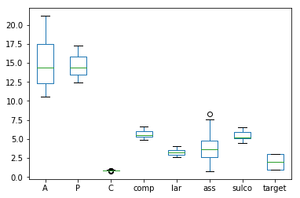
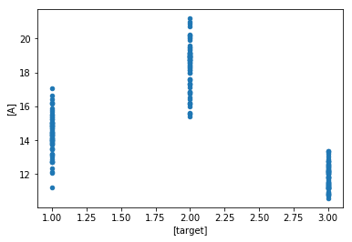

**Universidade do Estado do Amazonas**

**Disciplina: Redes Neurais Artificiais**

**Professora: [Elloá B. Guedes](https://github.com/elloa)**

**Alunos: [Jakson Kelvin](https://github.com/jacksonks),[Jailson Pereira](https://github.com/jailsonpj)**

# Projeto prático 4 - Classificação de varidades de trigo

# Descrição

Três variedades de trigo (Kama, Rosa e Canadian) possuem sementes muito parecidas,
entretanto diferentes. Um grupo de pesquisadores poloneses coletou 70 amostras de cada
tipo e, usando uma técnica particular de raio-X, coletou medidas geométricas destas
sementes, a citar: área, perímetro, compactude, comprimento, largura, coeficiente de
assimetria e comprimento do sulco da semente. O dataset detalhado contendo as medições
pode ser encontrado em: https://archive.ics.uci.edu/ml/datasets/seeds#

[PDF da descrição do projeto](https://github.com/jailsonpj/neural_network/blob/master/projetos_praticos/projeto-4/rna-2018.2-pp4.pdf)


# Bibliotecas necessárias no projeto

- Pandas
- Numpy
- Sklearn
- Matplotlib

# Importando bibliotecas e módulos necessário no projeto


```python
import pandas as pd
import numpy as np
import sklearn
import matplotlib.pyplot as plt
from sklearn.model_selection import train_test_split
from sklearn.metrics import confusion_matrix,accuracy_score,precision_score,recall_score,f1_score
from sklearn.model_selection import GridSearchCV
from sklearn.neural_network import MLPClassifier
import seaborn as sns
```

Como requisito do Projeto, as redes serão construídas com um *busca em grade* utilizando o módulo GridSearchCV da Sklearn.

GridSearchCV implementa um método de “ajuste” e “pontuação”. Também implementa “predict”, “predict_proba”, “decision_function”, “transform” e “inverse_transform” se eles forem implementados no estimador usado.

Os parâmetros do estimador usados para aplicar esses métodos são otimizados pela pesquisa de grade com validação cruzada sobre uma grade de parâmetros.


# Visualização dos Dados


```python
data = pd.read_csv('seeds_dataset.txt',delimiter='\t',header=None,names=['A','P','C','comp','lar','ass','sulco','target'])
```


```python
data.head(5)
```


<div>
<style scoped>
    .dataframe tbody tr th:only-of-type {
        vertical-align: middle;
    }

    .dataframe tbody tr th {
        vertical-align: top;
    }

    .dataframe thead th {
        text-align: right;
    }
</style>
<table border="1" class="dataframe">
  <thead>
    <tr style="text-align: right;">
      <th></th>
      <th>A</th>
      <th>P</th>
      <th>C</th>
      <th>comp</th>
      <th>lar</th>
      <th>ass</th>
      <th>sulco</th>
      <th>target</th>
    </tr>
  </thead>
  <tbody>
    <tr>
      <th>0</th>
      <td>15.26</td>
      <td>14.84</td>
      <td>0.8710</td>
      <td>5.763</td>
      <td>3.312</td>
      <td>2.221</td>
      <td>5.220</td>
      <td>1.0</td>
    </tr>
    <tr>
      <th>1</th>
      <td>14.88</td>
      <td>14.57</td>
      <td>0.8811</td>
      <td>5.554</td>
      <td>3.333</td>
      <td>1.018</td>
      <td>4.956</td>
      <td>1.0</td>
    </tr>
    <tr>
      <th>2</th>
      <td>14.29</td>
      <td>14.09</td>
      <td>0.9050</td>
      <td>5.291</td>
      <td>3.337</td>
      <td>2.699</td>
      <td>4.825</td>
      <td>1.0</td>
    </tr>
    <tr>
      <th>3</th>
      <td>13.84</td>
      <td>13.94</td>
      <td>0.8955</td>
      <td>5.324</td>
      <td>3.379</td>
      <td>2.259</td>
      <td>4.805</td>
      <td>1.0</td>
    </tr>
    <tr>
      <th>4</th>
      <td>16.14</td>
      <td>14.99</td>
      <td>0.9034</td>
      <td>5.658</td>
      <td>3.562</td>
      <td>1.355</td>
      <td>5.175</td>
      <td>1.0</td>
    </tr>
  </tbody>
</table>
</div>


**Os dados são composto por 7 preditores e um 1 atributo alvo:**

**- Atributos preditores:**
    - Área (A)
    - Perímetro (P)
    - Compactação (C)
    - Comprimento do Núcleo (comp)
    - Largura do Núcleo (lar)
    - Coeficiente de assimetria (ass)
    - Comprimento do sulco do núcleo (sulco)
**- Atributo Alvo:**
    - Target


```python
data.columns
```


    Index(['A', 'P', 'C', 'comp', 'lar', 'ass', 'sulco', 'target'], dtype='object')


## Limpeza de dados - retirando dados faltantes:


```python
#limpando dados
data_novo = data.dropna(axis=0)
```


```python
data_novo.head(5)
```


<div>
<style scoped>
    .dataframe tbody tr th:only-of-type {
        vertical-align: middle;
    }

    .dataframe tbody tr th {
        vertical-align: top;
    }

    .dataframe thead th {
        text-align: right;
    }
</style>
<table border="1" class="dataframe">
  <thead>
    <tr style="text-align: right;">
      <th></th>
      <th>A</th>
      <th>P</th>
      <th>C</th>
      <th>comp</th>
      <th>lar</th>
      <th>ass</th>
      <th>sulco</th>
      <th>target</th>
    </tr>
  </thead>
  <tbody>
    <tr>
      <th>0</th>
      <td>15.26</td>
      <td>14.84</td>
      <td>0.8710</td>
      <td>5.763</td>
      <td>3.312</td>
      <td>2.221</td>
      <td>5.220</td>
      <td>1.0</td>
    </tr>
    <tr>
      <th>1</th>
      <td>14.88</td>
      <td>14.57</td>
      <td>0.8811</td>
      <td>5.554</td>
      <td>3.333</td>
      <td>1.018</td>
      <td>4.956</td>
      <td>1.0</td>
    </tr>
    <tr>
      <th>2</th>
      <td>14.29</td>
      <td>14.09</td>
      <td>0.9050</td>
      <td>5.291</td>
      <td>3.337</td>
      <td>2.699</td>
      <td>4.825</td>
      <td>1.0</td>
    </tr>
    <tr>
      <th>3</th>
      <td>13.84</td>
      <td>13.94</td>
      <td>0.8955</td>
      <td>5.324</td>
      <td>3.379</td>
      <td>2.259</td>
      <td>4.805</td>
      <td>1.0</td>
    </tr>
    <tr>
      <th>4</th>
      <td>16.14</td>
      <td>14.99</td>
      <td>0.9034</td>
      <td>5.658</td>
      <td>3.562</td>
      <td>1.355</td>
      <td>5.175</td>
      <td>1.0</td>
    </tr>
  </tbody>
</table>
</div>


## visualizando distribuição de dados:


```python
data_novo.plot.box(['target'])
```


    <matplotlib.axes._subplots.AxesSubplot at 0x7f5af3ca7710>





```python
data_novo.plot.scatter(['target'],['A'])
```


    <matplotlib.axes._subplots.AxesSubplot at 0x7f5af3b99978>





# Separando os rótulos do conjunto de dados para treinamento


```python
# separando target
y = data_novo['target']
X = data_novo.drop('target',axis=1)

```


```python

X.head()
```


<div>
<style scoped>
    .dataframe tbody tr th:only-of-type {
        vertical-align: middle;
    }

    .dataframe tbody tr th {
        vertical-align: top;
    }

    .dataframe thead th {
        text-align: right;
    }
</style>
<table border="1" class="dataframe">
  <thead>
    <tr style="text-align: right;">
      <th></th>
      <th>A</th>
      <th>P</th>
      <th>C</th>
      <th>comp</th>
      <th>lar</th>
      <th>ass</th>
      <th>sulco</th>
    </tr>
  </thead>
  <tbody>
    <tr>
      <th>0</th>
      <td>15.26</td>
      <td>14.84</td>
      <td>0.8710</td>
      <td>5.763</td>
      <td>3.312</td>
      <td>2.221</td>
      <td>5.220</td>
    </tr>
    <tr>
      <th>1</th>
      <td>14.88</td>
      <td>14.57</td>
      <td>0.8811</td>
      <td>5.554</td>
      <td>3.333</td>
      <td>1.018</td>
      <td>4.956</td>
    </tr>
    <tr>
      <th>2</th>
      <td>14.29</td>
      <td>14.09</td>
      <td>0.9050</td>
      <td>5.291</td>
      <td>3.337</td>
      <td>2.699</td>
      <td>4.825</td>
    </tr>
    <tr>
      <th>3</th>
      <td>13.84</td>
      <td>13.94</td>
      <td>0.8955</td>
      <td>5.324</td>
      <td>3.379</td>
      <td>2.259</td>
      <td>4.805</td>
    </tr>
    <tr>
      <th>4</th>
      <td>16.14</td>
      <td>14.99</td>
      <td>0.9034</td>
      <td>5.658</td>
      <td>3.562</td>
      <td>1.355</td>
      <td>5.175</td>
    </tr>
  </tbody>
</table>
</div>


# Definindo arquitetura da rede neural

## Parâmetros do modelo da rede neural

A quantidade de neurônios nas camadas ocultas levam em consideração a fórmula descrita no projeto , onde o 'a' foi definido em 0.5, 2 e 3


```python
#para a=0.5
param1 = {'hidden_layer_sizes':[(1,1),(2,)],'activation':['relu','tanh','logistic'],'learning_rate_init':[0.01,0.1,0.001]}

#para a=2 e com 1 neurônio na camada de saída
param2 = {'hidden_layer_sizes':[(3,3),(2,4),(4,2),(6,),(2,3,1)],'activation':['relu','tanh','logistic'],'learning_rate_init':[0.01,0.1,0.001]}

#para a=3
param3 = {'hidden_layer_sizes':[(8,),(4,4),(2,6),(6,2),(7,1),(1,7)],'activation':['relu','tanh'],'learning_rate_init':[0.01,0.1,0.001]}
```

## Solver usado no projeto

O *solver* utilizado no projeto foi o *lbfgs*. Foi escolhido este solver devido que para conjuntos de dados pequenos, os "lbfgs" podem convergir mais rapidamente e ter melhor desempenho. Já o *adam* que é o padrão do método *MPLClassifier* funciona muito bem para conjunto de dados relativamente grande (com milhares de amostras de dados) em termos de tempo de treinamento e pontuação de validação.


```python
model = MLPClassifier(solver='lbfgs')
```

# Treinamento levando em consideração o a = 0.5


```python
clf = GridSearchCV(model,param1,cv=3)
```


```python
clf.fit(X,y)
```


    GridSearchCV(cv=3, error_score='raise',
           estimator=MLPClassifier(activation='relu', alpha=0.0001, batch_size='auto', beta_1=0.9,
           beta_2=0.999, early_stopping=False, epsilon=1e-08,
           hidden_layer_sizes=(100,), learning_rate='constant',
           learning_rate_init=0.001, max_iter=200, momentum=0.9,
           nesterovs_momentum=True, power_t=0.5, random_state=None,
           shuffle=True, solver='lbfgs', tol=0.0001, validation_fraction=0.1,
           verbose=False, warm_start=False),
           fit_params=None, iid=True, n_jobs=1,
           param_grid={'hidden_layer_sizes': [(1, 1), (2,)], 'activation': ['relu', 'tanh', 'logistic'], 'learning_rate_init': [0.01, 0.1, 0.001]},
           pre_dispatch='2*n_jobs', refit=True, return_train_score='warn',
           scoring=None, verbose=0)


## Acurácia dos modelos gerados


```python
acc_models = pd.DataFrame(clf.grid_scores_)
acc_models['mean_validation_score']
```

    /home/jailson/anaconda3/lib/python3.7/site-packages/sklearn/model_selection/_search.py:762: DeprecationWarning: The grid_scores_ attribute was deprecated in version 0.18 in favor of the more elaborate cv_results_ attribute. The grid_scores_ attribute will not be available from 0.20
      DeprecationWarning)


    0     0.457286
    1     0.341709
    2     0.487437
    3     0.532663
    4     0.527638
    5     0.457286
    6     0.341709
    7     0.341709
    8     0.341709
    9     0.341709
    10    0.512563
    11    0.341709
    12    0.613065
    13    0.442211
    14    0.442211
    15    0.864322
    16    0.703518
    17    0.849246
    Name: mean_validation_score, dtype: float64


## Parâmetros da melhor rede 


```python
pd.DataFrame(clf.best_params_)
```


<div>
<style scoped>
    .dataframe tbody tr th:only-of-type {
        vertical-align: middle;
    }

    .dataframe tbody tr th {
        vertical-align: top;
    }

    .dataframe thead th {
        text-align: right;
    }
</style>
<table border="1" class="dataframe">
  <thead>
    <tr style="text-align: right;">
      <th></th>
      <th>activation</th>
      <th>hidden_layer_sizes</th>
      <th>learning_rate_init</th>
    </tr>
  </thead>
  <tbody>
    <tr>
      <th>0</th>
      <td>logistic</td>
      <td>2</td>
      <td>0.01</td>
    </tr>
  </tbody>
</table>
</div>


## Acurácia do melhor modelo gerado


```python
clf.best_score_
```


    0.864321608040201


## Acurácia das predições geradas pelo melhor modelo


```python
predict = clf.predict(X)
```


```python
accuracy_score(y,predict)
```


    0.9597989949748744


# Treinamento levando em consideração o a = 2


```python
clf1 = GridSearchCV(model,param2,cv=3)
```


```python
clf1.fit(X,y)
```


    GridSearchCV(cv=3, error_score='raise',
           estimator=MLPClassifier(activation='relu', alpha=0.0001, batch_size='auto', beta_1=0.9,
           beta_2=0.999, early_stopping=False, epsilon=1e-08,
           hidden_layer_sizes=(100,), learning_rate='constant',
           learning_rate_init=0.001, max_iter=200, momentum=0.9,
           nesterovs_momentum=True, power_t=0.5, random_state=None,
           shuffle=True, solver='lbfgs', tol=0.0001, validation_fraction=0.1,
           verbose=False, warm_start=False),
           fit_params=None, iid=True, n_jobs=1,
           param_grid={'hidden_layer_sizes': [(3, 3), (2, 4), (4, 2), (6,), (2, 3, 1)], 'activation': ['relu', 'tanh', 'logistic'], 'learning_rate_init': [0.01, 0.1, 0.001]},
           pre_dispatch='2*n_jobs', refit=True, return_train_score='warn',
           scoring=None, verbose=0)


## Acurácia dos modelos gerados


```python
acc_models = pd.DataFrame(clf1.grid_scores_)
acc_models['mean_validation_score']
```

    /home/jailson/anaconda3/lib/python3.7/site-packages/sklearn/model_selection/_search.py:762: DeprecationWarning: The grid_scores_ attribute was deprecated in version 0.18 in favor of the more elaborate cv_results_ attribute. The grid_scores_ attribute will not be available from 0.20
      DeprecationWarning)


    0     0.341709
    1     0.834171
    2     0.477387
    3     0.537688
    4     0.341709
    5     0.341709
    6     0.537688
    7     0.341709
    8     0.502513
    9     0.688442
    10    0.939698
    11    0.683417
    12    0.341709
    13    0.537688
    14    0.522613
    15    0.668342
    16    0.718593
    17    0.341709
    18    0.532663
    19    0.527638
    20    0.477387
    21    0.798995
    22    0.839196
    23    0.713568
    24    0.547739
    25    0.713568
    26    0.703518
    27    0.341709
    28    0.452261
    29    0.341709
    30    0.849246
    31    0.869347
    32    0.798995
    33    0.698492
    34    0.512563
    35    0.854271
    36    0.768844
    37    0.819095
    38    0.829146
    39    0.849246
    40    0.864322
    41    0.894472
    42    0.341709
    43    0.557789
    44    0.638191
    Name: mean_validation_score, dtype: float64


## Parâmetros da melhor rede


```python
pd.DataFrame(clf1.best_params_)
```


<div>
<style scoped>
    .dataframe tbody tr th:only-of-type {
        vertical-align: middle;
    }

    .dataframe tbody tr th {
        vertical-align: top;
    }

    .dataframe thead th {
        text-align: right;
    }
</style>
<table border="1" class="dataframe">
  <thead>
    <tr style="text-align: right;">
      <th></th>
      <th>activation</th>
      <th>hidden_layer_sizes</th>
      <th>learning_rate_init</th>
    </tr>
  </thead>
  <tbody>
    <tr>
      <th>0</th>
      <td>relu</td>
      <td>6</td>
      <td>0.1</td>
    </tr>
  </tbody>
</table>
</div>


## Acurácia do melhor modelo gerado


```python
clf.best_score_
```


    0.864321608040201


## Acurácia das predições geradas pelo melhor modelo 


```python
predict = clf1.predict(X)
```


```python
accuracy_score(y,predict)
```


    0.9849246231155779


# Treinamento levando em consideração a = 3


```python
clf2 = GridSearchCV(model,param3,cv=3)
```


```python
clf2.fit(X,y)
```


    GridSearchCV(cv=3, error_score='raise',
           estimator=MLPClassifier(activation='relu', alpha=0.0001, batch_size='auto', beta_1=0.9,
           beta_2=0.999, early_stopping=False, epsilon=1e-08,
           hidden_layer_sizes=(100,), learning_rate='constant',
           learning_rate_init=0.001, max_iter=200, momentum=0.9,
           nesterovs_momentum=True, power_t=0.5, random_state=None,
           shuffle=True, solver='lbfgs', tol=0.0001, validation_fraction=0.1,
           verbose=False, warm_start=False),
           fit_params=None, iid=True, n_jobs=1,
           param_grid={'hidden_layer_sizes': [(8,), (4, 4), (2, 6), (6, 2), (7, 1), (1, 7)], 'activation': ['relu', 'tanh'], 'learning_rate_init': [0.01, 0.1, 0.001]},
           pre_dispatch='2*n_jobs', refit=True, return_train_score='warn',
           scoring=None, verbose=0)


## Acurácia do modelos gerados


```python
acc_models = pd.DataFrame(clf2.grid_scores_)
acc_models['mean_validation_score']
```

    /home/jailson/anaconda3/lib/python3.7/site-packages/sklearn/model_selection/_search.py:762: DeprecationWarning: The grid_scores_ attribute was deprecated in version 0.18 in favor of the more elaborate cv_results_ attribute. The grid_scores_ attribute will not be available from 0.20
      DeprecationWarning)


    0     0.683417
    1     0.708543
    2     0.869347
    3     0.653266
    4     0.608040
    5     0.708543
    6     0.492462
    7     0.542714
    8     0.341709
    9     0.542714
    10    0.678392
    11    0.522613
    12    0.341709
    13    0.341709
    14    0.341709
    15    0.341709
    16    0.537688
    17    0.537688
    18    0.884422
    19    0.924623
    20    0.904523
    21    0.618090
    22    0.557789
    23    0.814070
    24    0.678392
    25    0.522613
    26    0.718593
    27    0.713568
    28    0.824121
    29    0.638191
    30    0.839196
    31    0.723618
    32    0.633166
    33    0.341709
    34    0.341709
    35    0.341709
    Name: mean_validation_score, dtype: float64


## Parâmetros da melhor rede


```python
pd.DataFrame(clf2.best_params_)
```


<div>
<style scoped>
    .dataframe tbody tr th:only-of-type {
        vertical-align: middle;
    }

    .dataframe tbody tr th {
        vertical-align: top;
    }

    .dataframe thead th {
        text-align: right;
    }
</style>
<table border="1" class="dataframe">
  <thead>
    <tr style="text-align: right;">
      <th></th>
      <th>activation</th>
      <th>hidden_layer_sizes</th>
      <th>learning_rate_init</th>
    </tr>
  </thead>
  <tbody>
    <tr>
      <th>0</th>
      <td>tanh</td>
      <td>8</td>
      <td>0.1</td>
    </tr>
  </tbody>
</table>
</div>


## Acurácia do melhor modelo gerado


```python
clf2.best_score_
```


    0.9246231155778895


## Acurácia das predições geradas pelo melhor modelo


```python
predict = clf2.predict(X)
```


```python
accuracy_score(y,predict)
```


    0.9798994974874372


# Conclusão

*Levando em consideração os melhores modelos gerados, conforme o cálculo para uma certa quantidade de neurônios em uma camada oculta, o modelo que obteve a melhor acurácia foi o modelo que leva em consideração o alfa = 2. Onde o melhor modelo gerado pelo GrindSearchCV deu a acurácia com o valor igual a **0.98** com os seguintes parâmetros:*
    
   **- Activation:** relu
   
   **- hidden_layer_sizes:** 6
   
   **- Learning_rate_init:** 0.1
   
*As outras redes cujo o alfa com valores de 0.5 e 3, obtiveram uma acurácia de* **0.95** e **0.97**  


```python

```
